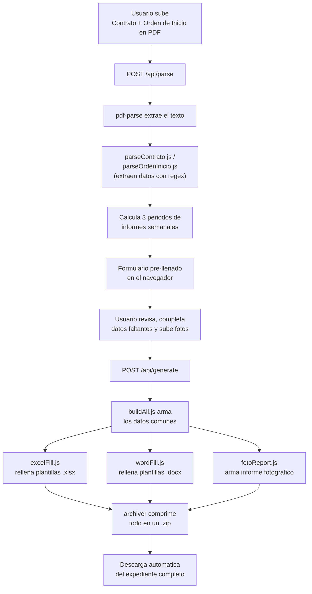

# Generador de Expedientes — Gerencia de Infraestructura

Herramienta interna para armar automáticamente el expediente administrativo de un proyecto vial (7 documentos) a partir de dos PDF: el **Contrato de Obra Pública** y la **Orden de Inicio**.

## En qué consiste (resumen para presentación)


Antes esto se hacía llenando 7 documentos uno por uno a mano. Ahora, con solo dos PDF, la herramienta arma todo el expediente en minutos.

## Cómo funciona (detalle técnico)



## Documentos generados

1. Acuerdo de Pago (Excel)
2. Ficha Técnica (Excel)
3. Solicitud de Formalización (Excel)
4. Informes Semanales — 3 periodos, una hoja cada uno (Excel)
5. Memo de Avance Físico (Word)
6. Memorando a Tesorería (Word)
7. Informe Fotográfico con las fotos de avance (Word)

Todos se entregan comprimidos en un único `.zip`.

## Stack técnico

- **Backend:** Node.js + Express (`server.js`)
- **Lectura de PDF:** `pdf-parse`
- **Plantillas Excel:** `exceljs`
- **Plantillas Word:** `docxtemplater` + `docx`
- **Compresión:** `archiver`
- **Frontend:** HTML/CSS/JS plano, sin framework (`public/`)

## Correr en local

```bash
npm install
npm start
```

Sirve en `http://localhost:4173`.
